<div align="center">

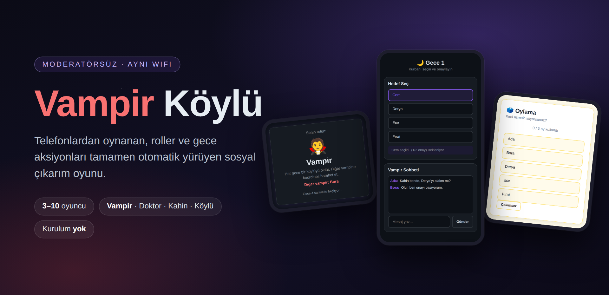

<br>

**Moderatörsüz, esnek oyunculu, aynı WiFi üzerinden telefonlardan oynanan Vampir Köylü oyunu.**

[**🎮 Canlı Demo**](https://vampir-bz87.onrender.com/) · [Kurulum](#-kurulum) · [Nasıl Oynanır](#-nasıl-oynanır) · [Ekran Görüntüleri](#-ekran-görüntüleri)

   

</div>

---

## ✨ Neler Var?

| | |
|---|---|
| 🧛 **Moderatör gerekmez** | Roller, gece aksiyonları, oylama ve kazanan kontrolü tamamen otomatik |
| 👥 **3–10 oyuncu** | Vampir sayısı, doktor ve kahin açık/kapalı — host lobide ayarlar |
| 📱 **Kurulum yok** | Herkes tarayıcıdan bağlanır, uygulama indirmez |
| 🔒 **Şifreli lobiler** | Aynı ağda birden fazla oyun aynı anda dönebilir |
| 🔄 **Kopan bağlantı sorun değil** | Sayfa yenilense bile oyuncu aynı role geri döner |
| 👁️ **İzleyici modu** | Ölen oyuncular tüm rolleri ve gizli aksiyonları izler |

---

## 🚀 Kurulum

```bash
git clone https://github.com/denizardaslan/vampir.git
cd vampir
npm install
npm start
```

Sunucu `http://localhost:3000` adresinde başlar.

### Telefonlardan Bağlanmak

1. Bilgisayarın local IP adresini bul:
   ```bash
   ipconfig getifaddr en0        # macOS
   hostname -I                   # Linux
   ```
2. Tüm telefonlar **aynı WiFi ağında** olmalı.
3. Telefonda tarayıcı aç: `http://192.168.x.x:3000` (kendi IP'ini yaz)

> **Not:** Mac'te ilk çalıştırmada "Gelen bağlantılara izin ver" uyarısı çıkarsa **İzin Ver**'e bas.

---

## 🎮 Nasıl Oynanır

1. Oyuncu ilk ekranda sadece **adını** girer.
2. Sonraki ekranda **açık lobileri** görür veya kendi lobisini kurar.
3. Lobi kuran oyuncu lobi adı ve opsiyonel şifre belirler; otomatik **host** olur.
4. Diğer oyuncular listeden lobiyi seçer, varsa şifreyi girip katılır.
5. Host doktor, kahin, vampir sayısı, ilk gece öldürme ve tartışma süresi ayarlarını yapar.
6. En az **3 oyuncu** olduğunda host **Oyunu Başlat**'a basar.
7. Herkes kendi rolünü görür, gece başlar. Oyun buradan sonra tamamen otomatik ilerler.

### Tur Akışı

```
Rol Açıklaması  →  🌙 Gece  →  🩸 Sabah  →  ☀️ Tartışma  →  🗳️ Oylama  →  🌙 Gece ...
   (5 sn)         (aksiyonlar)  (ölüm)      (3/5/7 dk)     (60 sn)
```

Gece: vampirler ortak hedef seçip onaylar, doktor birini korur, kahin birinin rolünü öğrenir.
Tüm aksiyonlar tamamlanınca sabah otomatik açılır — kimsenin "gözler kapansın" demesine gerek yok.

### Roller

| Rol | Sayı | Görev |
|-----|------|-------|
| 🧛 **Vampir** | 1–3 | Her gece bir köylüyü öldür, diğer vampirle gizli sohbette anlaş |
| 👨‍⚕️ **Doktor** | 0–1 | Her gece birini koru (art arda iki gece kendini koruyamaz) |
| 🔮 **Kahin** | 0–1 | Her gece bir kişinin vampir olup olmadığını öğren |
| 🧑‍🌾 **Köylü** | Kalanlar | Konuş, ikna et, doğru kişiyi as |

**Kazanma:** Tüm vampirler asılırsa köylüler; vampir sayısı diğerlerine eşitlenirse vampirler kazanır.
10 gün sonunda oyun bitmezse berabere.

### Denge Kontrolü

Host adaletsiz kurulumları başlatamaz — sunucu şunları engeller:

- Vampirlerin başlangıçta çoğunluğa çok yakın olduğu kurulumlar
- İlk gece öldürmenin açık olduğu ve vampirlerin ilk sabah otomatik kazanacağı kurulumlar
- Bağlantısı kopmuş oyuncu varken oyuna başlamak

---

## 📸 Ekran Görüntüleri

<table>
  <tr>
    <td width="33%" align="center">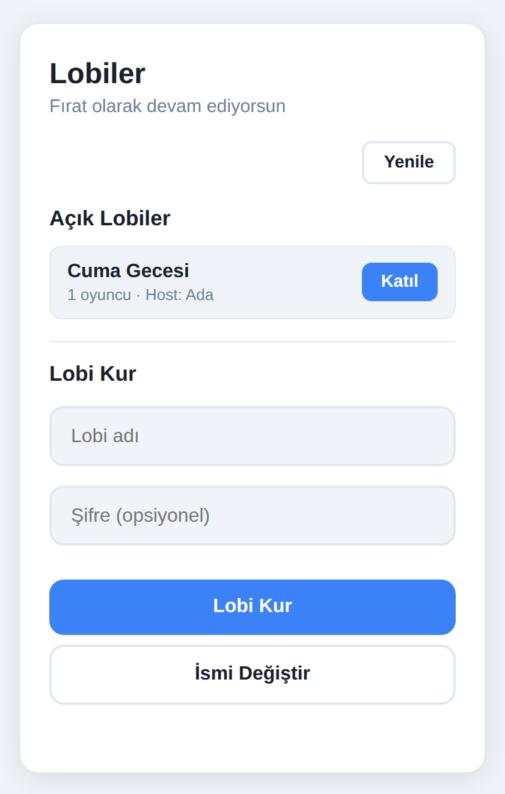<br><sub><b>Lobi tarayıcı</b><br>Açık lobileri gör veya kendi lobini kur</sub></td>
    <td width="33%" align="center">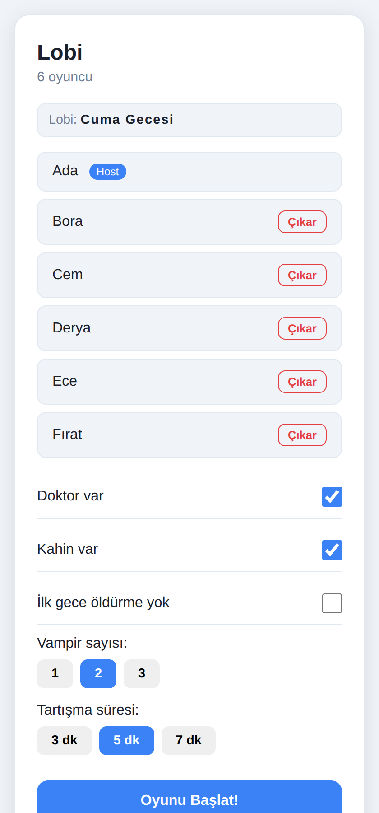<br><sub><b>Host paneli</b><br>Roller, vampir sayısı, süre ayarları</sub></td>
    <td width="33%" align="center">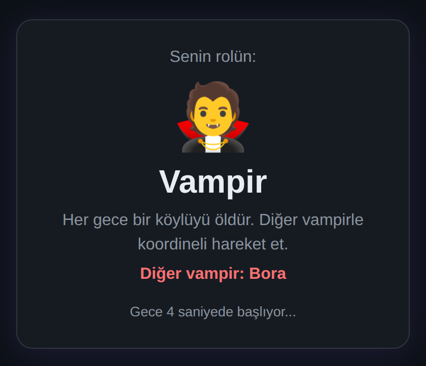<br><sub><b>Rol kartı</b><br>Herkes rolünü kendi telefonunda görür</sub></td>
  </tr>
  <tr>
    <td align="center">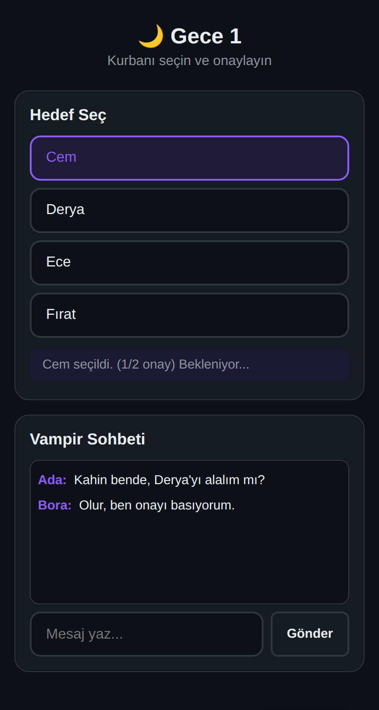<br><sub><b>Gece — Vampir</b><br>Ortak hedef seçimi + gizli sohbet</sub></td>
    <td align="center">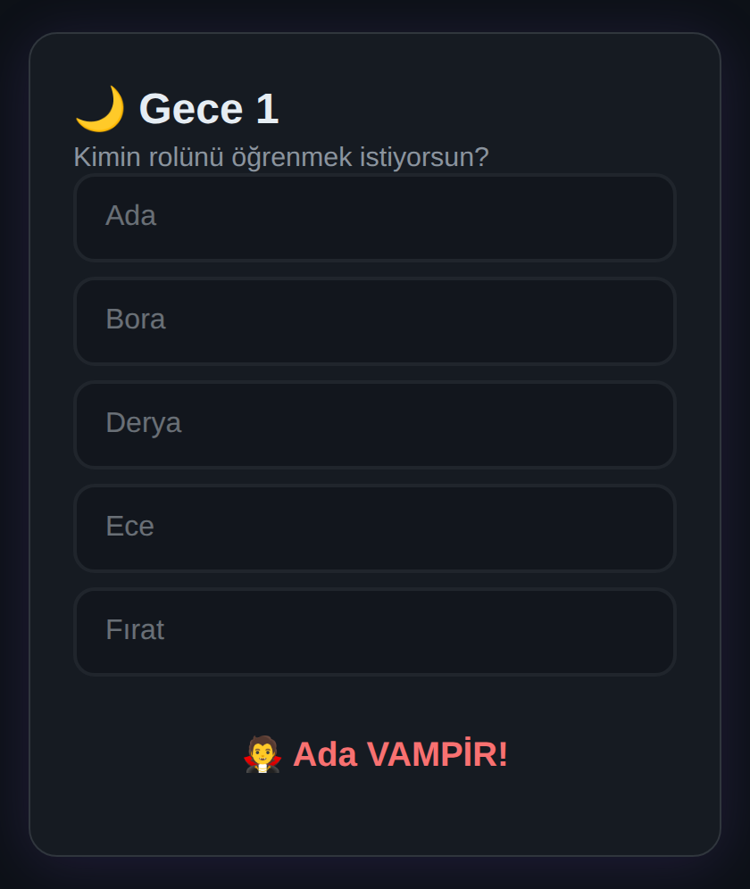<br><sub><b>Gece — Kahin</b><br>Sorgulanan kişinin sonucu</sub></td>
    <td align="center">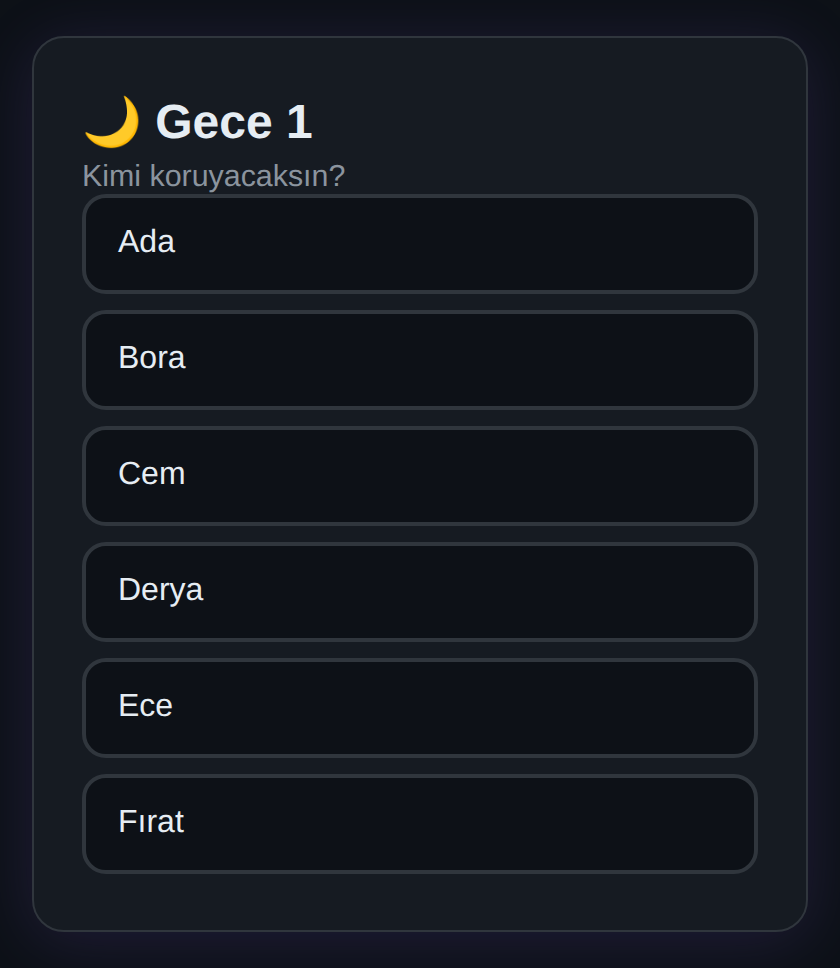<br><sub><b>Gece — Doktor</b><br>Korunacak kişinin seçimi</sub></td>
  </tr>
  <tr>
    <td align="center">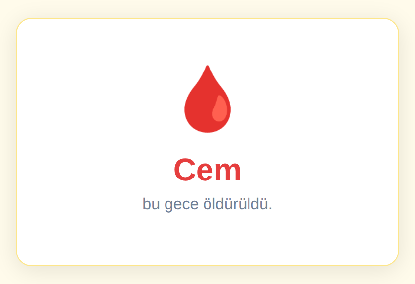<br><sub><b>Sabah</b><br>Gece kimin öldüğü açıklanır</sub></td>
    <td align="center">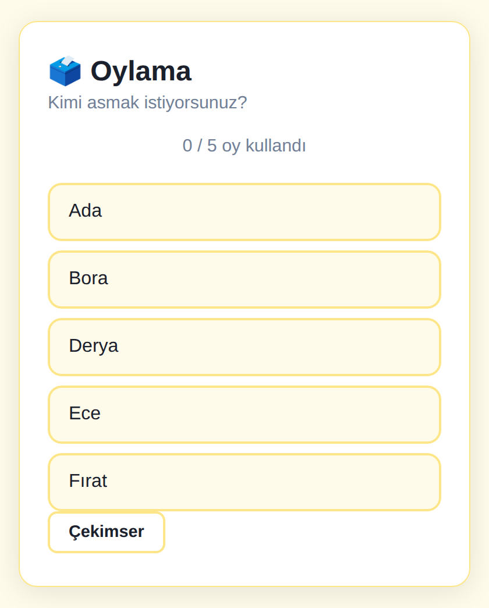<br><sub><b>Oylama</b><br>Canlı oy sayacı, çekimser hakkı</sub></td>
    <td align="center">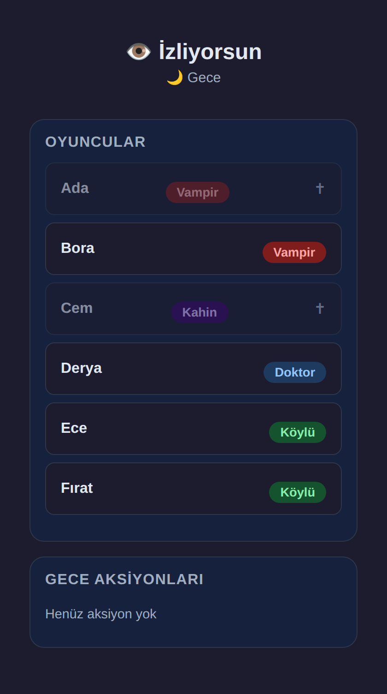<br><sub><b>İzleyici</b><br>Ölenler tüm rolleri ve aksiyonları görür</sub></td>
  </tr>
  <tr>
    <td align="center">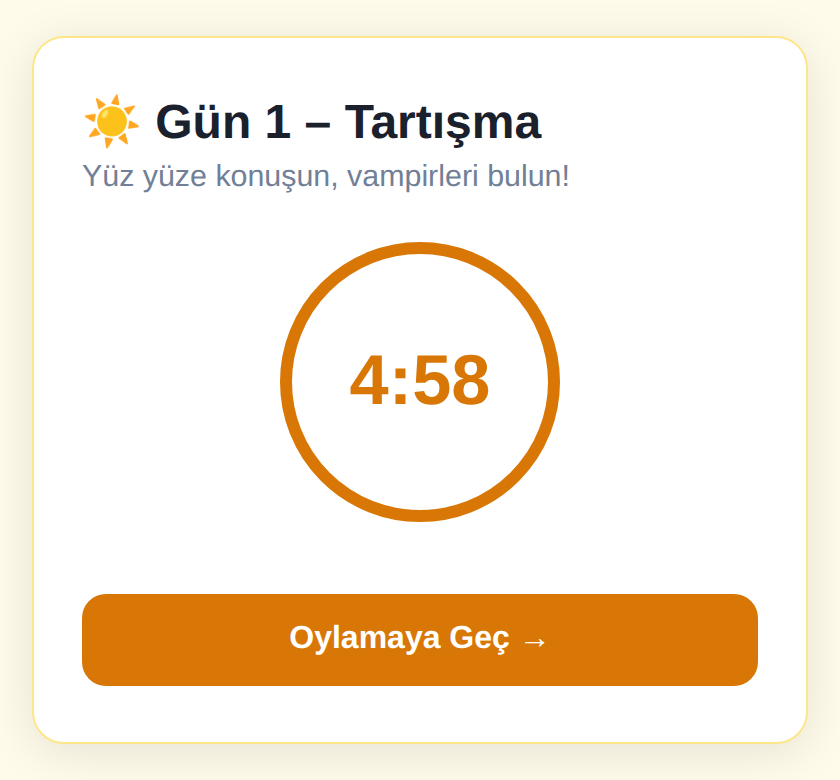<br><sub><b>Tartışma</b><br>Geri sayım, host erken bitirebilir</sub></td>
    <td align="center">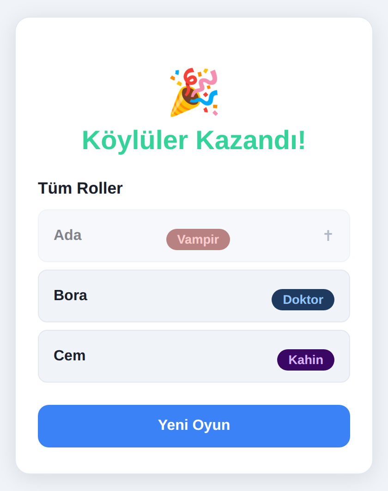<br><sub><b>Oyun sonu</b><br>Kazanan ve tüm roller</sub></td>
    <td align="center">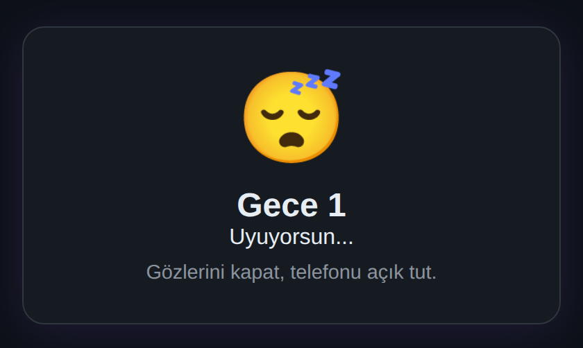<br><sub><b>Gece — Köylü</b><br>Aksiyonu olmayanlar uyur</sub></td>
  </tr>
</table>

---

## 🧪 Test

```bash
npm test          # sunucu kurallarının birim testleri (node:test)
```

Tek bilgisayarda denemek için farklı tarayıcı sekmeleri veya gizli pencereler yeterli.

Tüm oyuncuların rollerini ve gizli aksiyonlarını **tek panelden** izlemek istersen test arayüzünü aç:

```bash
ENABLE_TEST_DASHBOARD=true npm start
# → http://localhost:3000/test.html
```

> Bu panel tüm rolleri sızdırdığı için canlı ortamda kapalıdır; sadece bu ortam değişkeniyle açılır.

---

## 🛠️ Teknik

| | |
|---|---|
| **Sunucu** | Node.js + Express + Socket.IO — tüm oyun durumu bellekte, veritabanı yok |
| **İstemci** | Bağımlılıksız vanilla JS + CSS (build adımı yok) |
| **Oturum** | `localStorage`'daki oyuncu kimliği + sunucu tarafı token ile yeniden bağlanma |

```
server.js                 oyun motoru, socket olayları, denge kuralları
public/index.html         tüm ekranlar tek sayfada
public/app.js             istemci durum makinesi
public/style.css          gündüz / gece / izleyici temaları
public/test.html · test.js · test.css    geliştirici paneli (varsayılan kapalı)
test/server.test.js       sunucu birim testleri
docs/                     README görselleri
```

### Ortam Değişkenleri

| Değişken | Varsayılan | Açıklama |
|---|---|---|
| `PORT` | `3000` | Sunucu portu |
| `ENABLE_TEST_DASHBOARD` | `false` | `true` ise `/test.html` geliştirici paneli açılır |

### Yayına Alma

Render benzeri bir platformda `npm start` komutu ve `PORT` değişkeni yeterlidir; başka yapılandırma gerekmez.
Oyun durumu bellekte tutulduğu için sunucu yeniden başlatıldığında açık lobiler silinir.
